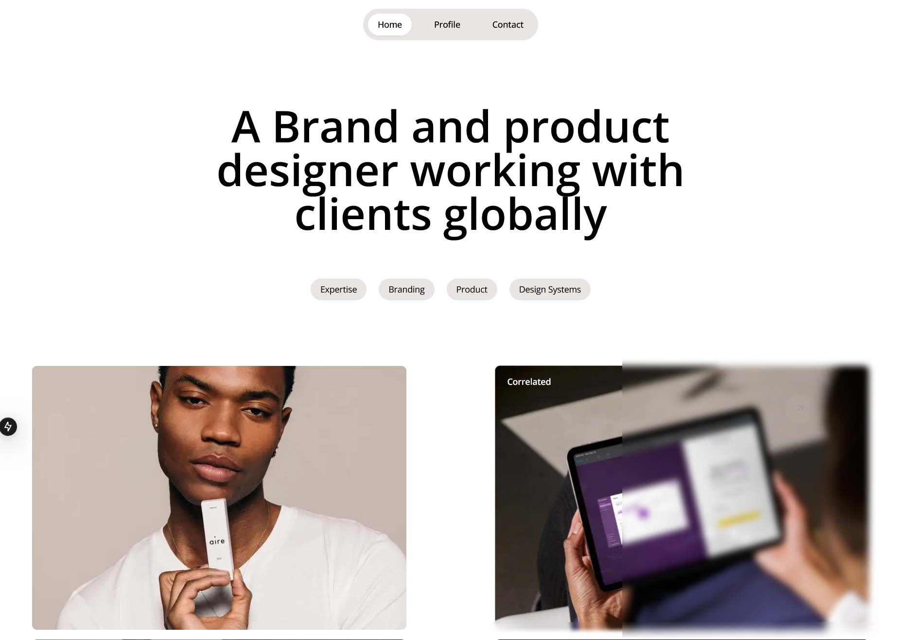

# OH Studio Clone Site



<p align="center">
  
  
  
</p>

## 👋 Welcome

Thanks for checking out this front-end practice challenge.
This is a clone of the old Bonsai website welcome page located at [Frontend Practice](https://www.frontendpractice.com/) website and is built with [Next.js](https://nextjs.org/).
Please check it out 😮 and let me know what you think.

## ⚙️ Tech Stack

- Next.js 14
- React 19
- TailwindCSS
- Typescript

## 🌐 Website URL

🔗 [Oh.Studio clone ](https://next-oh-studio.onrender.com/)

## 🤸 Quick Start

Follow this steps to setup the project locally on your machine.

**Prerequsites**

Make sure you have the following installed on your machine

- [Git](https://git-scm.com/)
- [Node.js](https://nodejs.org/en)
- [npm](https://www.npmjs.com/)

**Cloning the Repository**

```bash
git clone https://github.com/Miki0035/next-oh-studio
cd next-oh-studio
```

**Installation**

Install the project dependencies using npm:

```bash
npm install
```

**Running the Project**

```bash
npm run dev
```

Open [http://localhost:3000](http://localhost:3000) in your browser to view the project.
